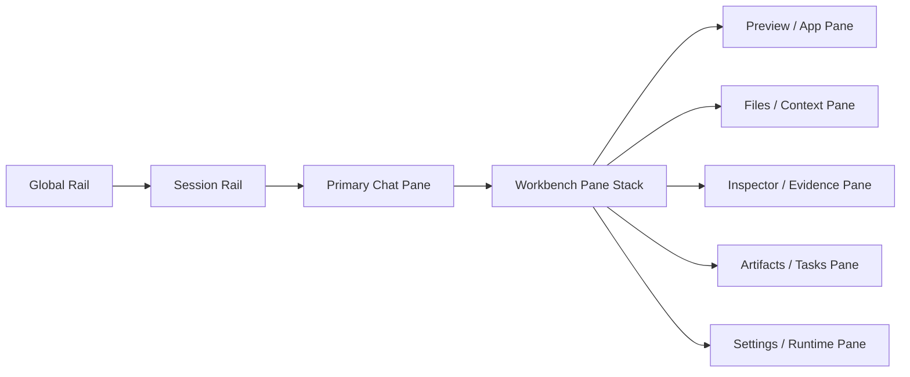

# Agentic Shell Spec

## 1. Product Thesis

Atlas should feel less like a website with many product tabs and more like a
clinical operating environment with one shared agentic shell.

The user does not "visit a page and optionally open chat."

The user enters a workspace:

- the chat already knows what workspace it is in
- the panes around the chat are part of the same run context
- files, previews, citations, tasks, settings, and artifacts are all first-class
- the agent can point to, open, fill, and reference those surfaces directly

The shell is the durable product. A workspace is a package that plugs into it.

## 2. North-Star Experience

The application opens into a stable multi-pane shell that supports four kinds
of work at once:

1. Steering the agent
2. Reviewing evidence
3. Manipulating a lightweight app surface
4. Producing durable artifacts

That means the user can:

- ask a question in chat
- watch the agent open a chart note, app preview, or file pane
- inspect the evidence behind a claim without leaving the run
- trigger a prepared workflow such as pre-op review
- export, fork, or carry the resulting workspace elsewhere

## 3. Design Principles

### 3.1 Agent As Operating System

The agent is not a helper widget. It is the organizing logic of the workspace.
The shell should make that obvious.

### 3.2 Docked, Not Scattered

The browser version should feel orderly and intentional. Panes can resize,
collapse, tab, pin, and fullscreen, but they should not become a chaotic
free-floating desktop simulator.

### 3.3 Deep Surface Coupling

Every meaningful object in the shell should be addressable by both the user and
the agent:

- a note
- a file
- a citation
- a candidate trial
- a settings profile
- a generated artifact
- a task in a board

### 3.4 Quiet Work Surfaces, Branded Atmosphere

The work shell should be restrained and legible. Ambient gradients, glow, and
"html-in-canvas" softness belong in the frame, empty states, workspace launch
states, and branded transitions. Clinical work surfaces stay crisp.

### 3.5 Portability Is A Product Feature

Each workspace should have a clear export / import / fork story. The user
should feel like they own the workspace state, not just the last answer.

### 3.6 One Harness, Two Workspace Families

The harness can stay shared without forcing every workspace to feel the same.

- Clinical Insights family
  Review-first. Calmer. Private by default. Dense with evidence and artifacts.
  It should not carry an always-on progress panel or workflow scoreboard unless
  the task truly needs it.
- Marketplace workspace family
  Action-first. Package-forward. More comfortable showing working-folder state,
  consent posture, guided steps, and module-specific actions when the package is
  operating on external systems or staged workflows.

The important distinction is behavioral, not only visual. Clinical Insights is
primarily about understanding and briefing. Marketplace workspaces are more
often about guided execution against a bounded package.

## 4. Shell Anatomy

## 5. Layout Zones

| Zone | Purpose | Typical Contents |
|---|---|---|
| Global Rail | App-level navigation | Home, Workspace Library, Patients, Review, Settings |
| Session Rail | Recent runs and threads | Workspace sessions, run history, pinned threads |
| Workspace Header | Context and controls | Workspace title, patient selector, workflow launcher, permissions, export |
| Primary Chat Pane | Steering and narrative | conversation, agent reasoning summary, approvals, quick actions |
| Workbench | Active supporting surfaces | preview, files, notes, tasks, evidence, lightweight app, settings |
| Drawer / Utility Layer | Ephemeral deep dives | detail drawers, compare panels, diff views, save destinations |
| Status Strip | Runtime state | active model, tool activity, sync, run status, unsaved changes |

## 6. Pane Roles

Every workspace can expose different panes, but the shell should treat them as
known roles.

| Role | Job | Typical Behaviors |
|---|---|---|
| `chat` | Main steering surface | pinned prompts, follow-ups, approvals, workspace-aware replies |
| `preview` | Live web/app/file rendering | open URL, render workspace app, compare artifact output |
| `files` | Workspace file tree and context | browse manifests, notes, templates, exports |
| `inspector` | Provenance and transparency | tool calls, citations, prompt assembly, runtime state |
| `artifacts` | Durable outputs | briefs, packets, reports, generated files, export options |
| `tasks` | Project / workflow management | board, checklist, due items, escalations |
| `settings` | Harness configuration | model, permissions, tools, context packages, workspace policies |
| `library` | Reusable workspace assets | packages, prompts, snippets, saved runs, templates |

## 7. Interaction Contract

The defining behavior of the shell is not the layout alone. It is the event
contract between the chat and the other panes.

### 7.1 Agent-To-Pane Actions

The agent should be able to:

- open a specific pane
- route an object into a specific pane
- focus a file or citation
- populate a preview with a generated artifact
- suggest a layout change for the current task
- open a settings or approval drawer when a run needs human confirmation

### 7.2 User-To-Agent Actions

The user should be able to:

- send the selected pane object back into chat as context
- pin a file, note, or artifact to the current run
- approve / reject a proposed action inline
- ask the agent to work only inside a chosen pane or file scope
- save a pane state as part of the workspace

### 7.3 Shared Object Model

Objects should have stable ids and be referenceable across panes:

- `artifact:preop-brief-v2`
- `citation:c_1042`
- `file:workspace.md`
- `trial:nct-01234567`
- `note:operative-clearance`
- `task:packet-followup-3`

That shared object model is what makes the harness feel deeply integrated.

## 8. Navigation Model

### 8.1 Global Navigation

The outer shell should collapse to a small durable rail with a short list of
destinations:

- Home
- Workspace Library
- Patients
- Clinical Insights
- Review / Trace
- Settings

Marketplace does not need to feel like a separate top-level website section. It
can live inside the Workspace Library / install flow while still having its own
strong identity.

### 8.2 Session Navigation

The second rail should be thread-like:

- recent sessions
- in-progress runs
- pinned workspaces
- recent artifacts
- resumable reviews

This is closer to Codex / Claude / Notion sidebars than a classic healthcare
left nav.

### 8.3 Workspace Navigation

Once inside a workspace, the user should not be bounced between many routes.
The preferred model is:

- one durable workspace route
- pane state drives most of the experience
- workflows change the active surfaces
- lightweight apps open inside the workbench rather than as separate products

### 8.4 Review / Trace Navigation

Logs, traces, and deeper runtime inspection should exist, but they do not need
to dominate the main clinical shell.

- Clinical Insights should open provenance, logs, and trace surfaces on demand
  or through a dedicated Review / Trace area.
- Marketplace workspaces may expose more run-state objects inline when the user
  is actively steering an outbound or staged workflow.

## 9. Recommended Layout States

### 9.1 Default Review State

- visible session rail
- medium chat pane
- one large workbench pane
- one secondary support pane

Best for Clinical Insights normal review and investigation.

### 9.2 Focus State

- chat + one dominant pane
- rails collapsed
- inspector hidden

Best for reading, editing, or presenting one artifact.

### 9.3 Execution State

- chat visible
- task / artifact pane visible
- inspector open
- preview or app pane open

Best for active marketplace or guided multi-step workflows.

### 9.4 Compare State

- chat narrowed
- two parallel workbench panes
- evidence drawer available

Best for comparing candidates, files, packet versions, or run outputs.

## 10. Visual Direction

### 10.1 Overall Feel

- calm
- editorial
- precise
- premium but not flashy
- software-native rather than dashboard-heavy

### 10.2 Typography

- expressive display face for headings and launch states
- clean sans for workspace content
- strong hierarchy between shell labels, pane titles, and artifact content

### 10.3 Surfaces

- soft warm neutral shell chrome
- bright but thin pane borders
- large radii on outer containers
- subtle glass / glow only in ambient regions
- dense clinical information lives on flatter paper-like surfaces

### 10.4 Html-In-Canvas Usage

Use the newer soft luminous "html-in-canvas" language selectively:

- workspace launch screens
- install / import flows
- empty states
- branded hero moments
- workspace identity banners

Do not let that softness reduce legibility in tables, notes, citations, or
clinical artifact review.

### 10.5 Family-Specific Mood

- Clinical Insights should feel like a clinical briefing surface:
  composed, dense, trust-building, and minimally theatrical.
- Marketplace workspaces can borrow more cowork energy, but should still avoid
  fluffy cards and vague AI-marketing gestures. They should feel like real work
  packages with clear boundaries and explicit objects.

## 11. Shell Families

The redesign should not force Clinical Insights and Marketplace workspaces into
the exact same mood.

### 11.1 Clinical Insights Shell

Clinical Insights should feel:

- private
- clinical
- interpretation-first
- evidence-dense
- calmer and less task-board oriented

Default behaviors:

- no progress tracker by default
- session stack can collapse when the user wants more review space
- workflow triggers can live in a library or list, but selected workflows can
  remain pinned on screen
- agent logs and traces do not need to be in the default workspace chrome and
  can live in a separate review / trace surface

### 11.2 Marketplace Shell

Marketplace workspaces should feel:

- action-oriented
- package-specific
- more cowork or guided-workspace flavored
- explicit about boundary, exports, and next actions

Default behaviors:

- stronger workspace identity in the header
- working folder and package context can be visible
- task and run-state side panels are acceptable when they support action
- workspace actions should be package-specific, not generic

### 11.3 Shared Contract

Both shell families still share:

- the same tabbed preview concept
- the same directory-style file surface
- the same workspace route model
- the same object reference model across chat, files, artifacts, and preview

## 12. Non-Goals

- not a floating-window desktop clone inside the browser
- not a collection of unrelated product tabs
- not a generic EHR dashboard with chat bolted on
- not a full custom UI for every workflow
- not an atmosphere-first redesign that weakens clinical readability
